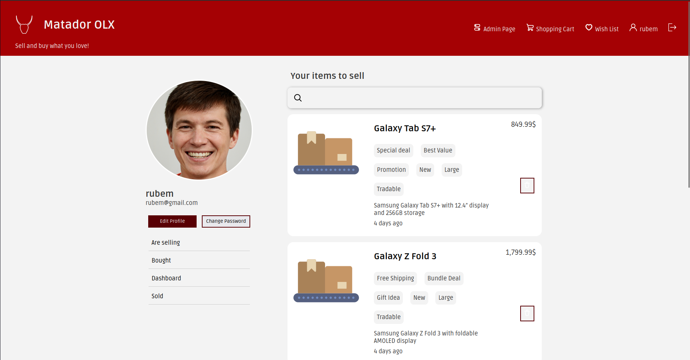

# Overview

This project was developed during the "Web Technologies Laboratory Course" course, where our task was to build an OLX clone using only pure PHP, HTML, CSS and JavaScript.

This project was tougher than I imagined. **Tailwind** and frameworks like **Laravel** really make things a LOT easier.

# Technologies and Categories

- HTML
- CSS
- JavaScript
- PHP
- SQLite

# What did I do?

During this project I contributed to a little bit of everything, but I was mostly involved in the **profile page** and the **admin dashboard** (similarly to the daily.dev website). I worked with the **Chart.js** library to show analytics in a more intuitive and simple way.

For the backend, **another team member and I developed the database schema and implemented it**, which took some time, but helped us learn a lot about how they work and what some of their specificities are.

# What have I learned?

This was the project that actually **taught me how web development works** and how to work with it. I would recommend anyone that really wants to understand how to develop for the web, for either frontend or backend, to work on a project (even if small) using the native technologies. It's hard but it is worth it.

# Would I do something differently?

I would probably give more of my time to develop a **small JavaScript framework** to facilitate the development of some of the components, as I saw done in some projects from previous years.
