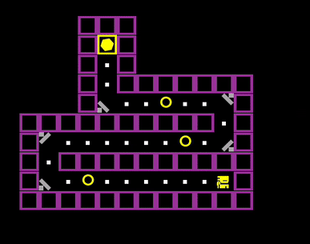
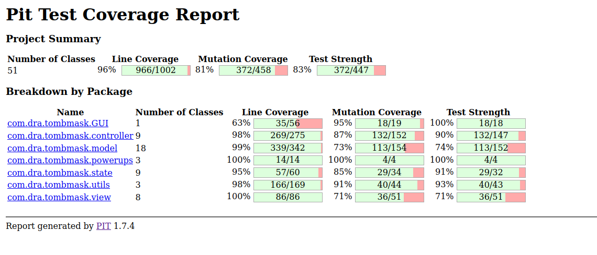

# Overview

This project was developed during the "Tests and Development Laboratory" course where the task was to develop a game using the Lanterna framework in Java. This framework is mostly focused on graphics.

Aside from the development of the game, **we had to learn and implement design patterns (at least 7 to have a good grade) and have tests for all of the functionalities of the game**.

# Technologies and Categories

- Design Patterns
- Java
- Lanterna
- Unit Tests
- Mockito

# What did I do?

In this project we used a font to display the different entities and **I was the one responsible for creating that font and most of the tests**. Aside from this, at the end **we had to refactor most of the code to adapt a larger number of design patterns and I had a big role in that process**.

# What have I learned?

**I learned how to create tests and how tests apply to different aspects of an application** and I wished to use that knowledge in more projects at University, but with a tight schedule for the projects, this was not really possible.

**This project had an important role in teaching me design patterns and how they work.** At first glance, design patterns seem kind of useless or just unnecessary junk, but after the end of that project **I realized their importance and how they can improve organization within a project**.

# Would I do something differently?

I would probably work more on the development of the game itself. For this course I shifted all my focus to creating tests and ensuring that we had good tests that really tested the features of the game and its logic.

**For that I am proud of the work we did**, but I feel like it could have helped me to be more experienced in Java at the time (that changed in the future, as I got to experience more of Java and fell in love with the language).