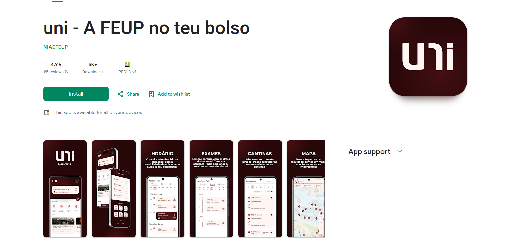

# Overview

This project was started in 2018 as an app to help improve the daily lives of the students at FEUP. Nowadays, **it supports the lives of around 5,000 students**.

**This is the biggest project that I have ever contributed (yet).**

# Technologies and Categories

- Flutter

# What did I do?

**When I joined the Informatics Club this was the first project that I started to contribute to** and, during the first year, I didn't have a lot of contributions. But during my second year, **I started to contribute more to the app** and I'm very thankful for that.

# What have I learned?

**During my years working on projects, I learned a lot about Flutter and Mobile Development.**

# Would I do something different?

I would spend more time contributing to the project, as I believe it would make me even more comfortable with mobile development and overall programming.