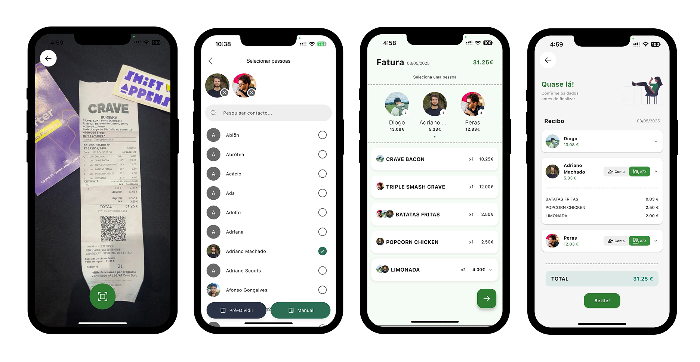

# Overview

This project was developed during the Shift Appens 2025 hackathon. **This hackathon is the biggest student-made hackathon in the country** and it is organized by the Informatics Club of the University of Coimbra.

**Our idea was to create an app where you can scan your bills and easily split them with friends and, at the end, a money request is sent to all parties involved.**

# Technologies

- Flutter

# What did I do?

**I was mostly responsible for the MBWAY (a payment service) integration with the app** and some of the functionalities, namely the modals present in the app and the flow of having accounts and debts with friends.

This feature of having accounts and debts with friends is already present in a similar app called "Splitwise" and we got the following question whenever we spoke about our idea: "Isn't this Splitwise?" **No, it is not Splitwise**. **Our focus is on the flow of scanning a bill and splitting it immediately with your friends.**

# What have I learned?

**I learned about handling my expectations better.** Before actually participating in the competition, my team and I thought that our idea was too good to not win at least something. We went, did a good job, but in the end we didn't win.

At the time, I couldn't wrap my head around the fact that we hadn't won but **it made me think and at the same time helped me deal better with failure.**

# Would I do something differently?

To be completely honest, I don't know what went wrong for us to not win anything and I don't say that as someone who is trying to brag or flex, I just don't know. But maybe, sometime in the future I get some sort of feedback or understand it.
