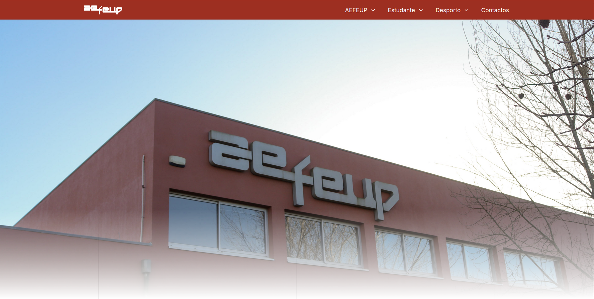

# Overview

This project was created as a request from the Student Association of my University.

# Technologies and Categories

- React
- Next.js
- TailwindCSS
- Payload CMS
- Docker

# What did I do?

**Alongside my co-coordinator of projects at the Informatics Club, we took the leadership role for this project and were responsible for organizing the tasks and what was to be done in the project.**

Aside from this, we were on the development team so I contributed to all parts of the project. **I was the one responsible for most of the Payload CMS integration and participated in the development of all of the pages on the website.**

# What have I learned?

**My main takeaways from this project were leadership and organization skills.** As one of the people at the head of the project, I had to be able to contribute and, at the same time, organize the team.

**Another important thing that I learned was that motivation is really important within a team and sometimes it may be more of a challenge to motivate your team than I thought.**

# Would I do something differently?

If I could, I would probably spend more of my time organizing the project in terms of which tasks were more important and should be implemented, which was the main issue during development.